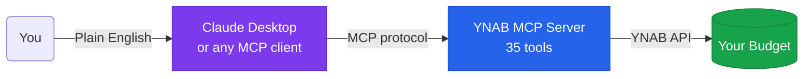
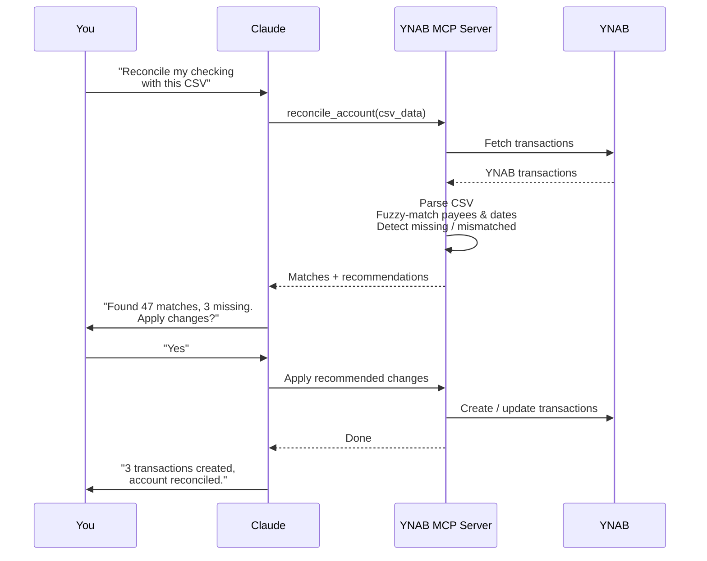

<div align="center">

# YNAB MCP Server

**Connect YNAB to any AI assistant. Manage your budget in plain English.**

[](https://github.com/dizzlkheinz/ynab-mcpb/releases/latest)
[](https://www.npmjs.com/package/@dizzlkheinz/ynab-mcpb)
[](LICENSE)
[](https://nodejs.org)

</div>

---

## Demo

<div align="center">
  
  <br/>
  <sub>Paste a receipt &rarr; itemized split transaction in seconds</sub>
</div>

---

## What you can do

| Workflow | Example prompt |
|---|---|
| Receipt split | "Create a split transaction for this receipt and allocate tax." |
| Bank reconciliation | "Reconcile my checking account using this CSV." |
| Spending analysis | "What did I spend on takeout this month?" |
| Scheduled cash flow | "What scheduled bills and income are due this month?" |
| Transaction creation | "Create a transaction: $42.18 at Trader Joe's yesterday." |
| Month overview | "Show my budget summary for January." |

---

## How it works



---

## Features

- **Receipt itemization** — Paste a receipt, get an itemized split transaction with tax allocation automatically distributed across line items.
- **Bank reconciliation (beta)** — Import a bank CSV, fuzzy-match against YNAB, detect missing or mismatched transactions, and apply bulk fixes.
- **35 YNAB tools** — Full coverage plus scheduled transactions and deterministic period analytics.
- **Write safety by default** — Preview mode requires a short-lived, single-use confirmation bound to the exact validated request.
- **Smaller tool profiles** — Choose `core`, `read-only`, or `full` at startup without dynamic registration.
- **Delta sync** — Fetches only changed data since the last request, keeping things fast.
- **Markdown or JSON** — All read tools support `response_format`: human-readable markdown tables (default) or structured JSON.
- **MCP-native** — Structured outputs, annotations, completions API, and resource templates.

---

## How reconciliation works

<details>
<summary>Show workflow diagram</summary>



</details>

---

## Setup (2 minutes)

### 1 — Get a YNAB token

1. Open [YNAB Web App](https://app.youneedabudget.com)
2. Go to **Account Settings &rarr; Developer Settings &rarr; New Token**
3. Copy it (shown once only)

### 2 — Install

<details>
<summary><strong>Claude Desktop — MCPB file (recommended)</strong></summary>

1. Download the latest `.mcpb` from [Releases](https://github.com/dizzlkheinz/ynab-mcpb/releases/latest)
2. Drag it into Claude Desktop
3. Enter your `YNAB_ACCESS_TOKEN` when prompted
4. Restart Claude Desktop

</details>

<details>
<summary><strong>Claude Desktop — npx</strong></summary>

Add to your Claude Desktop config:

```json
{
  "mcpServers": {
    "ynab": {
      "command": "npx",
      "args": ["-y", "@dizzlkheinz/ynab-mcpb@latest"],
      "env": {
        "YNAB_ACCESS_TOKEN": "your-token-here"
      }
    }
  }
}
```

</details>

<details>
<summary><strong>Cline (VS Code)</strong></summary>

```json
{
  "mcpServers": {
    "ynab": {
      "command": "npx",
      "args": ["-y", "@dizzlkheinz/ynab-mcpb@latest"],
      "env": {
        "YNAB_ACCESS_TOKEN": "your-token-here"
      }
    }
  }
}
```

</details>

<details>
<summary><strong>Codex</strong></summary>

```toml
[mcp_servers.ynab-mcpb]
command = "npx"
args = ["-y", "@dizzlkheinz/ynab-mcpb@latest"]
env = {"YNAB_ACCESS_TOKEN" = "your-token-here"}
startup_timeout_sec = 120
```

</details>

<details>
<summary><strong>Any other MCP client</strong></summary>

- **Command:** `npx`
- **Args:** `["-y", "@dizzlkheinz/ynab-mcpb@latest"]`
- **Env:** `YNAB_ACCESS_TOKEN=<your token>`

</details>

### 3 — Try these prompts

```
List my budgets and set the default to my main budget.
Show recent transactions in my checking account.
How much did I spend on groceries in the last 30 days?
Create a transaction: $42.18 at Trader Joe's yesterday.
```

---

## Tools (35)

<details>
<summary>See all tools by category</summary>

| Category | Tools |
|---|---|
| Budgets | `list_budgets` `get_budget` `get_default_budget` `set_default_budget` |
| Accounts | `list_accounts` `get_account` `create_account` |
| Transactions | `list_transactions` `get_transaction` `create_transaction` `create_transactions` `update_transaction` `update_transactions` `delete_transaction` `export_transactions` `compare_transactions` `create_receipt_split_transaction` |
| Categories | `list_categories` `get_category` `update_category` |
| Payees | `list_payees` `get_payee` |
| Months | `list_months` `get_month` |
| Reconciliation | `reconcile_account` |
| Scheduled transactions | `list_scheduled_transactions` `get_scheduled_transaction` `create_scheduled_transaction` `update_scheduled_transaction` `delete_scheduled_transaction` |
| Analytics | `analyze_spending` `compare_spending_periods` |
| Utilities | `get_user` `diagnostic_info` `clear_cache` |

All read tools accept `response_format` (`"markdown"` or `"json"`, default: `"markdown"`).

Full reference: [docs/reference/API.md](docs/reference/API.md)

</details>

---

## Configuration

| Variable | Default | Description |
|---|---|---|
| `YNAB_ACCESS_TOKEN` | — | **Required.** Your YNAB personal access token. |
| `YNAB_EXPORT_PATH` | `~/Downloads` | Directory for exported transaction files. |
| `YNAB_MCP_ENABLE_DELTA` | `true` | Enable delta sync (only fetch changed data). |
| `YNAB_MCP_WRITE_MODE` | `preview` | `read-only` hides YNAB mutations; `preview` requires exact confirmation; `enabled` permits direct writes. |
| `YNAB_MCP_TOOL_PROFILE` | `full` | `core`, `read-only`, or `full` startup tool surface. |
| `YNAB_MCP_CACHE_DEFAULT_TTL_MS` | `300000` | Cache TTL in milliseconds (5 min). |
| `YNAB_MCP_CACHE_MAX_ENTRIES` | `1000` | Maximum cache entries before LRU eviction. |

See `.env.example` for all options.

### Write modes and compatibility

`preview` is the conservative default. A mutation call first runs its existing `dry_run` path and returns a confirmation token. That token expires after two minutes, can be used once, and only authorizes the same canonical tool name and validated arguments. `read-only` does not register YNAB mutation tools. `enabled` preserves the pre-safety direct-write behavior for users who explicitly opt in.

Transaction amounts now prefer `amount_decimal` (for example, `-12.34`) or the explicit raw field `amount_milliunits` (`-12340`). Category funding similarly prefers `budgeted_decimal` or `budgeted_milliunits`. The old `amount` and `budgeted` fields remain accepted as deprecated milliunit aliases for backward compatibility; their meaning is never guessed.

### Tool profiles

Profiles are selected once at server startup, so clients receive a stable `tools/list` response:

- `core` keeps common reads, transaction safety workflows, reconciliation, receipt splitting, scheduled review, and spending analytics.
- `read-only` exposes every tool explicitly annotated read-only.
- `full` exposes the complete 35-tool surface, subject to the selected write mode.

## Privacy and trust

- The server process runs locally and communicates with YNAB over YNAB's API.
- Your YNAB personal access token is sensitive. Store it in your MCP client's secret configuration and never paste it into a conversation, issue, fixture, or log.
- Financial data returned by tools and included in a conversation may be processed by the AI provider selected in your MCP client. Review that provider's data controls before sharing sensitive details.
- Transaction exports remain on local disk at `YNAB_EXPORT_PATH` (or the platform default). The server does not upload exported files elsewhere.
- Use `read-only` for no YNAB writes, `preview` for exact request confirmation, or `enabled` only when direct writes are an intentional compatibility choice.
- This independent open-source project is not affiliated with or endorsed by YNAB.

---

## Troubleshooting

| Symptom | Fix |
|---|---|
| `npx` fails | Install Node.js 24+, then restart your MCP client. |
| Auth errors | Regenerate your YNAB token and update `YNAB_ACCESS_TOKEN`. |
| Tools not detected | Restart the MCP client after any config change. |
| Reconciliation issues | [Open an issue](https://github.com/dizzlkheinz/ynab-mcpb/issues) with an anonymized CSV sample. |

---

## For developers

```bash
git clone https://github.com/dizzlkheinz/ynab-mcpb.git
cd ynab-mcpb
npm install
cp .env.example .env   # add YNAB_ACCESS_TOKEN
npm run build
npm test
```

Architecture and contributor guidance: [`CLAUDE.md`](CLAUDE.md)

Reconciliation architecture: [`docs/technical/reconciliation-system-architecture.md`](docs/technical/reconciliation-system-architecture.md)

---

## Contributing

Bug reports and CSV edge-case repros are very welcome, especially for bank reconciliation:
[Open an issue](https://github.com/dizzlkheinz/ynab-mcpb/issues)

PRs welcome — run `npm test` and `npm run lint` before submitting.

---

## License

[AGPL-3.0](LICENSE)
