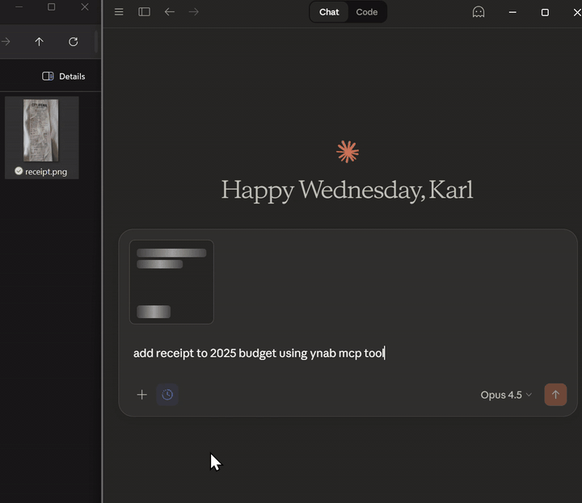

# YNAB MCP Server

[](https://github.com/dizzlkheinz/ynab-mcpb/releases/latest)
[](https://www.npmjs.com/package/@dizzlkheinz/ynab-mcpb)
[](LICENSE)

Connect YNAB to Claude Desktop (or any MCP client) and manage your budget in plain English.

Ask things like:

- "What did I spend on takeout this month?"
- "Create a split transaction for this receipt and allocate tax."
- "Reconcile my checking account from this CSV."

## 60-second demo

Receipt workflow demo (3x speed, lightweight embed):


[Open demo GIF directly](docs/assets/demo/receipt-itemization-demo-lite.gif)

- Receipt flow: paste receipt -> create transaction
- Reconciliation flow: import CSV -> review matches -> apply changes

## Why install this

- Faster than manual YNAB workflows for day-to-day checks and transaction entry
- Powerful receipt itemization and split creation
- Bank CSV reconciliation with fuzzy matching (beta)
- Works with any MCP-compatible client
- Local MCP server process on your machine, using your YNAB token

## Features

- **Receipt itemization:** Paste a receipt and create itemized split transactions with tax allocation.
- **Bank reconciliation (beta):** Import CSV, fuzzy-match against YNAB, detect missing/mismatched items, and apply fixes.
- **Full YNAB operations:** Budgets, accounts, transactions, categories, payees, and month analysis.
- **MCP-native implementation:** Structured tool outputs, annotations, completions, and resource templates.

## 2-minute setup

### 1) Get a YNAB access token

1. Open [YNAB Web App](https://app.youneedabudget.com)
2. Go to **Account Settings -> Developer Settings**
3. Click **New Token**
4. Copy it (shown once)

### 2) Add this MCP server

Use one of the options below:

#### Claude Desktop (recommended)

Option A (`.mcpb` package):

1. Download latest `.mcpb` from [Releases](https://github.com/dizzlkheinz/ynab-mcpb/releases/latest)
2. Drag into Claude Desktop
3. Paste `YNAB_ACCESS_TOKEN`
4. Restart Claude Desktop

Option B (`npx`):

```json
{
  "mcpServers": {
    "ynab": {
      "command": "npx",
      "args": ["-y", "@dizzlkheinz/ynab-mcpb@latest"],
      "env": {
        "YNAB_ACCESS_TOKEN": "your-token-here"
      }
    }
  }
}
```

#### Cline (VS Code)

```json
{
  "mcpServers": {
    "ynab": {
      "command": "npx",
      "args": ["-y", "@dizzlkheinz/ynab-mcpb@latest"],
      "env": {
        "YNAB_ACCESS_TOKEN": "your-token-here"
      }
    }
  }
}
```

#### Codex

```toml
[mcp_servers.ynab-mcpb]
command = "npx"
args = ["-y", "@dizzlkheinz/ynab-mcpb@latest"]
env = {"YNAB_ACCESS_TOKEN" = "your-token-here"}
startup_timeout_sec = 120
```

#### Any MCP client

- Command: `npx`
- Args: `["-y", "@dizzlkheinz/ynab-mcpb@latest"]`
- Env: `YNAB_ACCESS_TOKEN=<your token>`

### 3) Try these prompts

- "List my budgets and set the default to my main budget."
- "Show recent transactions in my checking account."
- "How much did I spend on groceries in the last 30 days?"
- "Create a transaction: $42.18 at Trader Joe's yesterday."

## Optional configuration

- `YNAB_EXPORT_PATH` - Directory for exported transaction files
- `YNAB_MCP_ENABLE_DELTA` - Enable/disable delta sync optimization (`true` by default)
- Caching options are available in `.env.example`

## Tools and docs

- 28 tools across budgets, accounts, transactions, categories, payees, months, reconciliation, and utilities
- Full tool reference: [docs/reference/API.md](docs/reference/API.md)
- Reconciliation architecture: [docs/technical/reconciliation-system-architecture.md](docs/technical/reconciliation-system-architecture.md)

## Troubleshooting

- If `npx` fails, make sure Node.js and npm are installed, then restart your MCP client.
- If tools return auth errors, regenerate your YNAB token and update `YNAB_ACCESS_TOKEN`.
- If a client does not detect tools, restart the client after MCP config changes.
- For parser/matching issues in reconciliation, open an issue with anonymized CSV samples.

## For developers

```bash
git clone https://github.com/dizzlkheinz/ynab-mcpb.git
cd ynab-mcpb
npm install
cp .env.example .env
# add YNAB_ACCESS_TOKEN
npm run build
npm test
```

Architecture and contributor guidance: `CLAUDE.md`

## Contributing

Bug reports and small repros are very welcome, especially for bank CSV reconciliation edge cases:
[Open an issue](https://github.com/dizzlkheinz/ynab-mcpb/issues)

PRs welcome. Please run `npm test` and `npm run lint` before submitting.

## License

[AGPL-3.0](LICENSE)
