# YNAB Reconciliation System - Technical Architecture Documentation

**Version:** 2.0
**Last Updated:** 2025-11-30
**Status:** Active Implementation

---

## Executive Summary

The YNAB Reconciliation System is a sophisticated transaction matching and balance verification engine that automatically reconciles bank statement CSV files against YNAB transactions. The system achieves 90%+ auto-match accuracy through intelligent fuzzy matching, progressive confidence scoring, and robust CSV parsing with multi-bank format support.

**Key Capabilities:**
- Automated transaction matching with 85%+ confidence threshold
- Multi-bank CSV format detection (TD, RBC, Scotiabank, Wealthsimple, Tangerine)
- Integer-based milliunit arithmetic (eliminates floating-point errors)
- Bulk transaction operations with correlation tracking
- Smart sign detection for liability accounts
- Actionable recommendations with prioritization

**Target Accuracy:** 90%+ auto-match rate for Canadian bank statements

---

## Table of Contents

1. [System Architecture](#1-system-architecture)
2. [Core Components](#2-core-components)
3. [Data Flow](#3-data-flow)
4. [Transaction Matching Algorithm](#4-transaction-matching-algorithm)
5. [CSV Parsing Engine](#5-csv-parsing-engine)
6. [Execution Engine](#6-execution-engine)
7. [Type System](#7-type-system)
8. [Integration Points](#8-integration-points)
9. [Performance Characteristics](#9-performance-characteristics)
10. [Testing Strategy](#10-testing-strategy)

---

## 1. System Architecture

### 1.1 High-Level Architecture

```mermaid
graph TB
    A[MCP Tool Entry Point] --> B[index.ts Handler]
    B --> C{Parse CSV}
    C --> D[csvParser.ts]
    D --> E[BankTransaction[]]

    B --> F{Fetch YNAB Data}
    F --> G[DeltaFetcher]
    G --> H[ynabAdapter.ts]
    H --> I[NormalizedYNABTransaction[]]

    E --> J[analyzer.ts]
    I --> J

    J --> K[matcher.ts]
    K --> L[Match Results]

    J --> M[recommendationEngine.ts]
    M --> N[Actionable Recommendations]

    L --> O{Execute Actions?}
    N --> O

    O -->|Yes| P[executor.ts]
    P --> Q[Bulk Operations]
    Q --> R[YNAB API Updates]

    O -->|No| S[reportFormatter.ts]
    L --> S
    N --> S
    S --> T[Human-Readable Report]

    R --> S

    T --> U[MCP Response]
```

### 1.2 Component Responsibility Matrix

| Component | Primary Role | Inputs | Outputs | Dependencies |
|-----------|-------------|--------|---------|--------------|
| **index.ts** | Orchestration | MCP Tool Request | CallToolResult | All components |
| **csvParser.ts** | CSV Parsing | Raw CSV string | BankTransaction[] | PapaParse, chrono-node |
| **ynabAdapter.ts** | YNAB Normalization | TransactionDetail[] | NormalizedYNABTransaction[] | YNAB SDK |
| **matcher.ts** | Matching Algorithm | Bank + YNAB Transactions | MatchResult[] | fuzzball |
| **analyzer.ts** | Analysis Orchestration | Parsed Data | ReconciliationAnalysis | matcher, recommendationEngine |
| **executor.ts** | Action Execution | Analysis + Params | ExecutionResult | YNAB API, transactionTools |
| **recommendationEngine.ts** | Recommendation Generation | Analysis | ActionableRecommendation[] | None (pure logic) |
| **reportFormatter.ts** | Human-Readable Output | Analysis + Execution | Formatted Report | None (pure formatting) |

### 1.3 Data Architecture

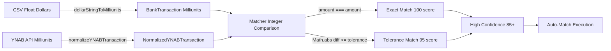

**Critical Design Decision:** All amounts use **milliunits (integers)** throughout the system. Conversion from CSV floats happens once at the parser boundary, then all comparisons use exact integer arithmetic (`===` instead of `Math.abs(a - b) < epsilon`).

---

## 2. Core Components

### 2.1 Entry Point: index.ts

**File:** `C:\Users\ksutk\projects\ynab-mcpb\src\tools\reconciliation\index.ts`

**Responsibilities:**
- MCP tool interface implementation
- Schema validation (ReconcileAccountSchema)
- CSV vs File input handling
- Date range auto-detection
- Smart sign inversion for liability accounts
- Orchestration of analysis and execution phases

**Key Functions:**

```typescript
export async function handleReconcileAccount(
  ynabAPI: ynab.API,
  deltaFetcher: DeltaFetcher,
  params: ReconcileAccountRequest,
): Promise<CallToolResult>
```

**Decision Tree:**

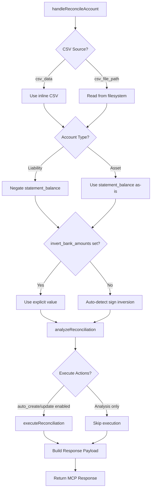

**Configuration Mapping:**

```typescript
// V2 Matching Configuration from Request Parameters
const config: MatchingConfig = {
  weights: {
    amount: 0.5,    // 50% weight
    date: 0.15,     // 15% weight
    payee: 0.35,    // 35% weight
  },
  dateToleranceDays: params.date_tolerance_days ?? 5,
  amountToleranceMilliunits: (params.amount_tolerance_cents ?? 1) * 10,
  autoMatchThreshold: params.auto_match_threshold ?? 90,
  suggestedMatchThreshold: params.suggestion_threshold ?? 60,
  minimumCandidateScore: 40,
  exactAmountBonus: 10,
  exactDateBonus: 5,
  exactPayeeBonus: 10,
};
```

---

### 2.2 CSV Parser: csvParser.ts

**File:** `C:\Users\ksutk\projects\ynab-mcpb\src\tools\reconciliation\csvParser.ts`

**Purpose:** Parse bank CSV exports into standardized BankTransaction objects with robust error handling and multi-format support.

**Architecture:**

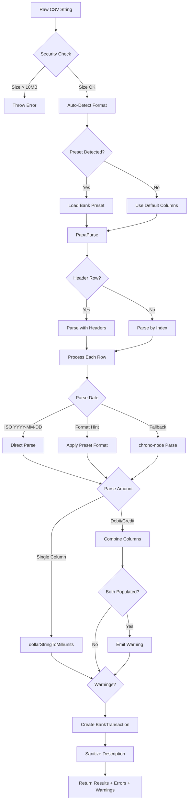

**Bank Presets:**

```typescript
export const BANK_PRESETS: Record<string, BankPreset> = {
  'td': {
    name: 'TD Canada Trust',
    header: false,  // Headerless CSV support
    dateColumn: ['0', 'Date'],
    debitColumn: '2',
    creditColumn: '3',
    descriptionColumn: ['1', 'Description'],
    dateFormat: 'MDY',  // MM/DD/YYYY
  },
  'rbc': {
    name: 'RBC Royal Bank',
    dateColumn: ['Transaction Date', 'Date'],
    debitColumn: 'Debit',
    creditColumn: 'Credit',
    descriptionColumn: ['Description 1', 'Description'],
    dateFormat: 'YMD',  // YYYY-MM-DD
  },
  'wealthsimple': {
    name: 'Wealthsimple',
    dateColumn: ['Date'],
    amountColumn: ['Amount'],
    descriptionColumn: ['Description', 'Payee'],
    amountMultiplier: 1,  // Already in correct sign
    dateFormat: 'YMD',
  },
  // ... scotiabank, tangerine
};
```

**Amount Conversion Logic:**

```typescript
function dollarStringToMilliunits(str: string): number {
  if (!str) return 0;

  // 1. Strip currency symbols and codes
  let cleaned = str
    .replace(/[$€£¥]/g, '')
    .replace(/\b(CAD|USD|EUR|GBP)\b/gi, '')
    .trim();

  // 2. Handle parentheses as negative: (123.45) → -123.45
  if (cleaned.startsWith('(') && cleaned.endsWith(')')) {
    cleaned = '-' + cleaned.slice(1, -1);
  }

  // 3. Detect European format: 1.234,56 → 1234.56
  if (/^-?\d{1,3}(\.\d{3})+,\d{2}$/.test(cleaned)) {
    cleaned = cleaned.replace(/\./g, '').replace(',', '.');
  }

  // 4. Handle thousands separator: 1,234.56 → 1234.56
  if (cleaned.includes('.')) {
    cleaned = cleaned.replace(/,/g, '');
  }

  const dollars = parseFloat(cleaned);
  if (!Number.isFinite(dollars)) return 0;

  // 5. Convert to milliunits: $1.00 → 1000
  return Math.round(dollars * 1000);
}
```

**Security Measures:**

```typescript
// Security: Remove malicious Unicode characters
rawDesc = rawDesc
  .replace(/[\u0000-\u001F\u007F-\u009F]/g, '')  // ASCII + C1 control chars
  .replace(/[\u202A-\u202E\u2066-\u2069]/g, '')  // Bidirectional overrides
  .replace(/[\u200B-\u200D\uFEFF]/g, '')         // Zero-width chars
  .replace(/[\u2028-\u2029]/g, '')                // Line/paragraph separators
  .substring(0, 500);  // YNAB max memo length
```

---

### 2.3 Transaction Matcher: matcher.ts

**File:** `C:\Users\ksutk\projects\ynab-mcpb\src\tools\reconciliation\matcher.ts`

**Purpose:** Match bank transactions to YNAB transactions using multi-dimensional scoring with configurable thresholds.

**Matching Pipeline:**

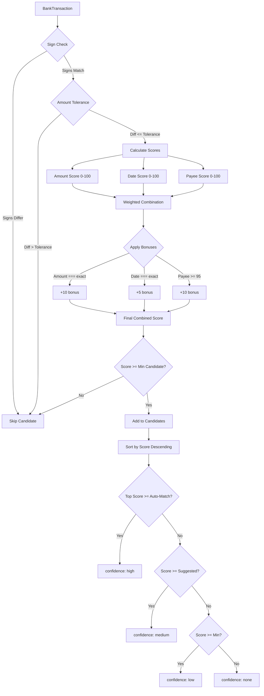

**Scoring Algorithms:**

**Amount Score (Integer Comparison):**

```typescript
const amountDiff = Math.abs(bankTxn.amount - ynabTxn.amount);
let amountScore: number;

if (amountDiff === 0) {
  // Exact integer match - no floating point issues!
  amountScore = 100;
} else if (amountDiff <= config.amountToleranceMilliunits) {  // Default: 10 (1 cent)
  amountScore = 95;
} else if (amountDiff <= 1000) {  // Within $1
  amountScore = 80 - (amountDiff / 1000 * 20);
} else {
  amountScore = Math.max(0, 60 - (amountDiff / 1000 * 5));
}
```

**Date Score (Days Difference):**

```typescript
const daysDiff = Math.abs(bankDate.getTime() - ynabDate.getTime()) / (1000 * 60 * 60 * 24);
let dateScore: number;

if (daysDiff < 0.5) {
  dateScore = 100;  // Same day
} else if (daysDiff <= 1) {
  dateScore = 95;   // 1 day
} else if (daysDiff <= config.dateToleranceDays) {  // Default: 7 days
  dateScore = 90 - ((daysDiff - 1) * (40 / config.dateToleranceDays));
} else {
  dateScore = Math.max(0, 50 - ((daysDiff - config.dateToleranceDays) * 5));
}
```

**Payee Score (Fuzzy Matching with Fuzzball):**

```typescript
import * as fuzz from 'fuzzball';

function calculatePayeeScore(bankPayee: string, ynabPayee: string | null): number {
  if (!ynabPayee) return 30;

  const scores = [
    fuzz.token_set_ratio(bankPayee, ynabPayee),    // Handles word order
    fuzz.token_sort_ratio(bankPayee, ynabPayee),   // Alphabetizes then compares
    fuzz.partial_ratio(bankPayee, ynabPayee),      // Best substring match
    fuzz.WRatio(bankPayee, ynabPayee),             // Weighted combination
  ];

  return Math.max(...scores);
}
```

**Why Fuzzball?**

| Input Bank | Input YNAB | Levenshtein | Fuzzball token_set_ratio |
|------------|------------|-------------|--------------------------|
| "AMZN MKTP CA*123456" | "Amazon" | 45 | 90 |
| "SQ *COFFEE SHOP TORONTO" | "Square Coffee" | 38 | 85 |
| "PAYPAL *NETFLIX" | "Netflix" | 54 | 100 |

**Tie-Breaking Rules:**

```typescript
candidates.sort((a, b) => {
  // 1. Sort by combined score
  const scoreDiff = b.scores.combined - a.scores.combined;
  if (scoreDiff !== 0) return scoreDiff;

  // 2. Prefer uncleared over cleared (expecting confirmation)
  const aUncleared = a.ynabTransaction.cleared === 'uncleared' ? 1 : 0;
  const bUncleared = b.ynabTransaction.cleared === 'uncleared' ? 1 : 0;
  if (aUncleared !== bUncleared) return bUncleared - aUncleared;

  // 3. Prefer closer date proximity
  const bankTime = new Date(bankTxn.date).getTime();
  const aDiff = Math.abs(bankTime - new Date(a.ynabTransaction.date).getTime());
  const bDiff = Math.abs(bankTime - new Date(b.ynabTransaction.date).getTime());
  if (aDiff !== bDiff) return aDiff - bDiff;

  return 0;
});
```

---

### 2.4 Analyzer: analyzer.ts

**File:** `C:\Users\ksutk\projects\ynab-mcpb\src\tools\reconciliation\analyzer.ts`

**Purpose:** Orchestrate the analysis phase, coordinating CSV parsing, YNAB normalization, matching, and insight generation.

**Analysis Pipeline:**

```mermaid
graph TD
    A[analyzeReconciliation] --> B{CSV Pre-Parsed?}
    B -->|Yes| C[Use Provided Result]
    B -->|No| D[parseCSV]

    C --> E[BankTransaction[]]
    D --> E

    A --> F[normalizeYNABTransactions]
    F --> G[NormalizedYNABTransaction[]]

    E --> H[findMatches]
    G --> H

    H --> I[MatchResult[]]

    I --> J[Categorize by Confidence]
    J --> K[auto_matches: high]
    J --> L[suggested_matches: medium]
    J --> M[unmatchedBank: low/none]

    G --> N[Find Unmatched YNAB]
    I --> N
    N --> O[unmatched_ynab]

    K --> P[calculateBalances]
    G --> P
    P --> Q[BalanceInfo]

    K --> R[generateSummary]
    L --> R
    M --> R
    O --> R
    Q --> R
    R --> S[ReconciliationSummary]

    S --> T[generateNextSteps]
    T --> U[next_steps: string[]]

    M --> V[detectInsights]
    S --> V
    Q --> V
    V --> W[insights: ReconciliationInsight[]]

    K --> X{Recommendations Enabled?}
    L --> X
    M --> X
    O --> X

    X -->|Yes| Y[generateRecommendations]
    Y --> Z[recommendations: ActionableRecommendation[]]

    S --> AA[Build ReconciliationAnalysis]
    U --> AA
    W --> AA
    Z --> AA

    AA --> AB[Return Analysis]
```

**Insight Detection:**

```typescript
function detectInsights(
  unmatchedBank: BankTransaction[],
  summary: ReconciliationSummary,
  balances: BalanceInfo,
  currency: string,
  csvErrors: ParseError[],
  csvWarnings: ParseWarning[],
): ReconciliationInsight[]
```

**Insight Types:**

| Type | Severity | Trigger | Purpose |
|------|----------|---------|---------|
| `csv-parse-errors` | critical/warning | CSV parsing errors | Surface parsing failures |
| `csv-parse-warnings` | info | CSV parsing warnings | Surface ambiguous data |
| `repeat_amount` | critical/warning | 2+ unmatched txns same amount | Highlight quick wins |
| `balance-gap` | critical/warning | Discrepancy > $1.00 | Focus attention on gap |

**Example Insight:**

```typescript
{
  id: 'repeat--45230',
  type: 'repeat_amount',
  severity: 'warning',
  title: '3 unmatched transactions at -$45.23',
  description: 'The bank statement shows 3 unmatched transaction(s) at -$45.23. Repeated amounts are usually the quickest wins — reconcile these first.',
  evidence: {
    amount: -45230,  // Milliunits
    occurrences: 3,
    dates: ['2025-09-15', '2025-09-20', '2025-09-25'],
    csv_rows: [2, 5, 8],
  },
}
```

---

### 2.5 Recommendation Engine: recommendationEngine.ts

**File:** `C:\Users\ksutk\projects\ynab-mcpb\src\tools\reconciliation\recommendationEngine.ts`

**Purpose:** Generate actionable, prioritized recommendations from reconciliation analysis results.

**Recommendation Types:**

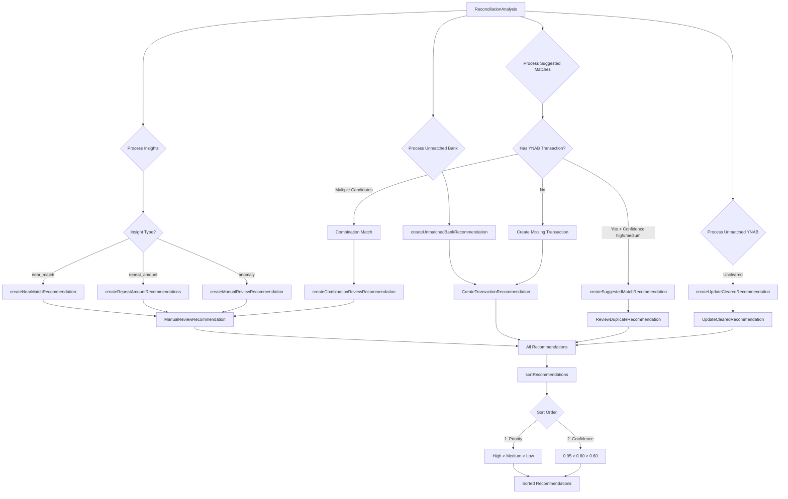

**Recommendation Schema:**

```typescript
export type ActionableRecommendation =
  | CreateTransactionRecommendation
  | UpdateClearedRecommendation
  | ReviewDuplicateRecommendation
  | ManualReviewRecommendation;

interface CreateTransactionRecommendation {
  action_type: 'create_transaction';
  priority: 'high' | 'medium' | 'low';
  confidence: number;  // 0-1
  message: string;
  reason: string;
  estimated_impact: MoneyValue;
  parameters: {
    account_id: string;
    date: string;
    amount: number;  // Milliunits
    payee_name: string;
    memo?: string;
    cleared: 'cleared' | 'uncleared';
    approved: boolean;
  };
}
```

**Confidence Levels:**

```typescript
const CONFIDENCE = {
  CREATE_EXACT_MATCH: 0.95,
  NEAR_MATCH_REVIEW: 0.7,
  REPEAT_AMOUNT: 0.75,
  ANOMALY_REVIEW: 0.5,
  UNMATCHED_BANK: 0.8,
  UPDATE_CLEARED: 0.6,
} as const;
```

**Priority Assignment:**

| Scenario | Action Type | Priority | Confidence | Rationale |
|----------|-------------|----------|------------|-----------|
| Unmatched bank txn | create_transaction | medium | 0.80 | Safe to create, medium urgency |
| Exact match suggestion | review_duplicate | high | 0.95 | High confidence match needs confirmation |
| Combination match | manual_review | medium | 0.70 | Complex scenario, needs human judgment |
| Uncleared YNAB txn | update_cleared | low | 0.60 | Cleanup action, low urgency |
| Anomaly insight | manual_review | low | 0.50 | Investigation needed |

---

### 2.6 Executor: executor.ts

**File:** `C:\Users\ksutk\projects\ynab-mcpb\src\tools\reconciliation\executor.ts`

**Purpose:** Execute reconciliation actions (create, update, clear, reconcile transactions) with bulk operation support and error handling.

**Execution Phases:**

```mermaid
graph TD
    A[executeReconciliation] --> B[Initialize State]
    B --> C[clearedDeltaMilli = cleared - statement]

    C --> D{Balance Aligned?}
    D -->|Yes| E[Skip Execution]
    D -->|No| F[PHASE 1: Auto-Create Missing]

    F --> G{auto_create_transactions?}
    G -->|No| H[Skip Phase 1]
    G -->|Yes| I{2+ Unmatched Bank?}

    I -->|Yes| J[Bulk Create Path]
    I -->|No| K[Sequential Create Path]

    J --> L[Build Batches Until Balance Aligns]
    L --> M[Chunk by MAX_BULK_CREATE_CHUNK = 100]
    M --> N[Process Each Chunk]

    N --> O{Bulk API Success?}
    O -->|Yes| P[Correlate Results]
    O -->|No| Q[Sequential Fallback]

    P --> R[Update clearedDeltaMilli]
    Q --> R
    K --> R

    R --> S{Balance Aligned?}
    S -->|Yes| T[Skip Remaining Phases]
    S -->|No| U[PHASE 2: Update Matched Txns]

    U --> V{auto_update_cleared_status?}
    V -->|Yes| W[Collect Updates]
    V -->|No| X[Skip Phase 2]

    W --> Y[Chunk by MAX_BULK_UPDATE_CHUNK = 100]
    Y --> Z[Batch Update API Call]

    Z --> AA{Balance Aligned?}
    AA -->|Yes| T
    AA -->|No| AB[PHASE 3: Auto-Unclear Missing]

    AB --> AC{auto_unclear_missing?}
    AC -->|Yes| AD[Collect Unclear Updates]
    AC -->|No| AE[Skip Phase 3]

    AD --> AF[Batch Unclear API Call]

    AF --> AG{Balance Aligned?}
    AG -->|Yes| T
    AG -->|No| AH[PHASE 4: Mark as Reconciled]

    AH --> AI[Batch Reconcile Matched Txns]

    T --> AJ[PHASE 5: Balance Reconciliation]
    AI --> AJ
    AH --> AJ

    AJ --> AK{statement_date provided?}
    AK -->|Yes| AL[buildBalanceReconciliation]
    AK -->|No| AM[Skip Balance Snapshot]

    AL --> AN[Refresh Account Snapshot]
    AM --> AN

    AN --> AO[Build Recommendations]
    AO --> AP[Return ExecutionResult]
```

**Bulk Operation Correlation:**

```typescript
// Generate deterministic import_id for deduplication
function generateBulkImportId(
  accountId: string,
  date: string,
  amountMilli: number,
  payee?: string | null,
): string {
  const normalizedPayee = (payee ?? '').trim().toLowerCase();
  const raw = `${accountId}|${date}|${amountMilli}|${normalizedPayee}`;
  const digest = createHash('sha256').update(raw).digest('hex').slice(0, 24);
  return `YNAB:bulk:${digest}`;
}

// Correlate bulk API response with requests
const correlated = correlateResults(
  chunk.map(entry => toCorrelationPayload(entry.saveTransaction)),
  response.data,
  duplicateImportIds
);

for (const result of correlated) {
  if (result.status === 'created') {
    // Success - record action
  } else if (result.status === 'duplicate') {
    // Duplicate detected - emit warning
    bulkDetails.duplicates_detected += 1;
  } else {
    // Failure - record error
    bulkDetails.transaction_failures += 1;
  }
}
```

**Error Handling Strategy:**

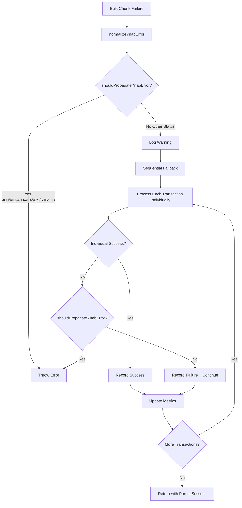

**Bulk Operation Metrics:**

```typescript
export interface BulkOperationDetails {
  chunks_processed: number;
  bulk_successes: number;
  sequential_fallbacks: number;
  duplicates_detected: number;
  failed_transactions: number;      // Backward-compatible alias
  bulk_chunk_failures: number;      // API-level failures (entire chunk)
  transaction_failures: number;     // Canonical per-transaction failures
  sequential_attempts?: number;     // Fallback creation attempts
}
```

---

### 2.7 Report Formatter: reportFormatter.ts

**File:** `C:\Users\ksutk\projects\ynab-mcpb\src\tools\reconciliation\reportFormatter.ts`

**Purpose:** Format reconciliation results into human-readable reports with structured sections.

**Report Structure:**

```
📊 [Account Name] Reconciliation Report
═══════════════════════════════════════════════════════════════

Statement Period: [date_range]

BALANCE CHECK
═══════════════════════════════════════════════════════════════
✓ YNAB Cleared Balance:  [amount]
✓ Statement Balance:     [amount]

[✅ BALANCES MATCH PERFECTLY | ❌ DISCREPANCY: [amount]]

TRANSACTION ANALYSIS
═══════════════════════════════════════════════════════════════
✓ Automatically matched:  [count] of [total] transactions
✓ Suggested matches:      [count]
✓ Unmatched bank:         [count]
✓ Unmatched YNAB:         [count]

❌ UNMATCHED BANK TRANSACTIONS:
   [date] - [payee]                         [±amount]
   ...

💡 SUGGESTED MATCHES:
   [date] - [payee]                         [±amount] ([confidence]% confidence)
   ...

KEY INSIGHTS
═══════════════════════════════════════════════════════════════
[🚨|⚠️|ℹ️] [insight.title]
   [insight.description]
   Evidence: [summary]

EXECUTION SUMMARY
═══════════════════════════════════════════════════════════════
• Transactions created:  [count]
• Transactions updated:  [count]
• Date adjustments:      [count]

Recommendations:
  • [recommendation 1]
  • [recommendation 2]
  ...

[⚠️ Dry run only — no YNAB changes were applied. | ✅ Changes applied to YNAB.]

RECOMMENDED ACTIONS
═══════════════════════════════════════════════════════════════
• [next_step 1]
• [next_step 2]
...
```

**Format Options:**

```typescript
export interface ReportFormatterOptions {
  accountName?: string;
  accountId?: string;
  currencyCode?: string;
  includeDetailedMatches?: boolean;
  maxUnmatchedToShow?: number;      // Default: 5
  maxInsightsToShow?: number;       // Default: 3
}
```

---

## 3. Data Flow

### 3.1 End-to-End Data Flow Diagram

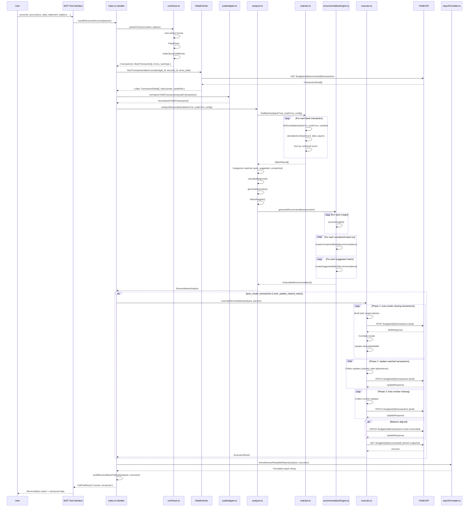

### 3.2 Data Transformation Chain

```mermaid
graph LR
    A[CSV String] -->|parseCSV| B[BankTransaction[]]
    C[YNAB API] -->|normalizeYNABTransactions| D[NormalizedYNABTransaction[]]

    B --> E{Matching}
    D --> E

    E -->|findMatches| F[MatchResult[]]

    F -->|Categorize| G[auto_matches]
    F -->|Categorize| H[suggested_matches]
    F -->|Categorize| I[unmatched_bank]

    D -->|Filter| J[unmatched_ynab]

    G --> K[ReconciliationAnalysis]
    H --> K
    I --> K
    J --> K

    K -->|generateRecommendations| L[ActionableRecommendation[]]

    K --> M{Execute?}
    L --> M

    M -->|Yes| N[executeReconciliation]
    N -->|YNAB API| O[ExecutionResult]

    M -->|No| P[Skip Execution]

    K --> Q[formatHumanReadableReport]
    O --> Q
    P --> Q

    Q --> R[Human-Readable Report]

    K --> S[buildReconciliationPayload]
    O --> S

    S --> T[Structured JSON Payload]

    R --> U[MCP Response]
    T --> U
```

---

## 4. Transaction Matching Algorithm

### 4.1 Matching Strategy

The reconciliation system uses a **multi-dimensional weighted scoring algorithm** with configurable thresholds and bonuses.

**Core Principles:**
1. **Amount is King** (50% weight) - Most reliable signal
2. **Dates are Unreliable** (15% weight) - Banks delay posting 3-7 days
3. **Payees are Fuzzy** (35% weight) - Merchant names vary significantly

**Default Configuration:**

```typescript
export const DEFAULT_CONFIG: MatchingConfig = {
  weights: {
    amount: 0.5,    // 50%
    date: 0.15,     // 15%
    payee: 0.35,    // 35%
  },
  amountToleranceMilliunits: 10,  // 1 cent (10 milliunits)
  dateToleranceDays: 7,
  autoMatchThreshold: 85,
  suggestedMatchThreshold: 60,
  minimumCandidateScore: 40,
  exactAmountBonus: 10,
  exactDateBonus: 5,
  exactPayeeBonus: 10,
};
```

### 4.2 Scoring Examples

**Example 1: Perfect Match**

```
Bank:   { date: '2025-09-15', amount: -45230, payee: 'Shell Gas' }
YNAB:   { date: '2025-09-15', amount: -45230, payee: 'Shell' }

Scores:
  Amount: 100 (exact match: -45230 === -45230)
  Date:   100 (same day)
  Payee:   85 (fuzz.token_set_ratio('Shell Gas', 'Shell'))

Combined = (100 * 0.5) + (100 * 0.15) + (85 * 0.35) = 94.75
Bonuses  = +10 (exact amount) + 5 (exact date) = +15
Final    = 94.75 + 15 = 109.75 → capped at 100

Confidence: HIGH (≥ 85)
```

**Example 2: Date Mismatch**

```
Bank:   { date: '2025-09-15', amount: -12799, payee: 'Amazon Marketplace' }
YNAB:   { date: '2025-09-20', amount: -12799, payee: 'Amazon' }

Scores:
  Amount: 100 (exact match)
  Date:    55 (5 days diff within tolerance)
  Payee:   92 (fuzz.token_set_ratio)

Combined = (100 * 0.5) + (55 * 0.15) + (92 * 0.35) = 90.45
Bonuses  = +10 (exact amount) + 10 (payee ≥ 95) = +20
Final    = 90.45 + 20 = 110.45 → capped at 100

Confidence: HIGH (≥ 85)
```

**Example 3: Suggested Match**

```
Bank:   { date: '2025-09-15', amount: -4520, payee: 'Coffee Shop A' }
YNAB:   { date: '2025-09-16', amount: -4530, payee: 'Coffee Shop B' }

Scores:
  Amount:  95 (10 milliunits diff within tolerance)
  Date:    95 (1 day diff)
  Payee:   70 (partial match)

Combined = (95 * 0.5) + (95 * 0.15) + (70 * 0.35) = 86.25
Bonuses  = 0 (no exact matches)
Final    = 86.25

Confidence: HIGH (≥ 85) but close to threshold
```

**Example 4: Low Confidence**

```
Bank:   { date: '2025-09-15', amount: -5000, payee: 'Transfer' }
YNAB:   { date: '2025-09-22', amount: -5005, payee: 'Payment' }

Scores:
  Amount:  95 (5 milliunits diff)
  Date:    35 (7 days diff at edge of tolerance)
  Payee:   40 (weak match)

Combined = (95 * 0.5) + (35 * 0.15) + (40 * 0.35) = 66.25
Bonuses  = 0
Final    = 66.25

Confidence: MEDIUM (60-84)
```

### 4.3 Candidate Filtering

**Pre-Filtering (Before Scoring):**

```typescript
// 1. Sign Check - both must be same sign
const bankSign = Math.sign(bankTxn.amount);
const ynabSign = Math.sign(ynabTxn.amount);
if (bankSign !== ynabSign && bankSign !== 0 && ynabSign !== 0) {
  continue;  // Skip candidate
}

// 2. Amount Tolerance Check - hard filter
const amountDiff = Math.abs(bankTxn.amount - ynabTxn.amount);
if (amountDiff > config.amountToleranceMilliunits) {
  continue;  // Skip candidate
}
```

**Post-Filtering (After Scoring):**

```typescript
// Only include if score ≥ minimumCandidateScore (default: 40)
if (scores.combined >= config.minimumCandidateScore) {
  candidates.push({ ynabTransaction, scores, matchReasons });
}
```

### 4.4 Guardrails & Failure Modes

**Auto-Match Disabled When:**

| Condition | Rationale |
|-----------|-----------|
| Amount score < 80 | Amount is most reliable signal |
| Date gap > 14 days | Even with delays, 2+ weeks is suspicious |
| Multiple candidates within 5 points | Ambiguous, needs human review |
| Payee score < 40 AND date score < 60 | Neither secondary signal is strong |
| Transaction has warnings | Parser detected ambiguity |

**Known Failure Modes:**

| Failure Mode | Mitigation Strategy |
|--------------|---------------------|
| Similar merchants (Starbucks #1234 vs #5678) | Require exact amount + date ≤1 day |
| Recurring subscriptions | Use date as primary discriminator |
| Refunds | Sign check prevents cross-matching |
| Split transactions | Combination matching (future) |
| Merchant name drift | Payee normalization + token_set_ratio |
| Duplicate entries | Prefer uncleared; flag for review |

---

## 5. CSV Parsing Engine

### 5.1 Multi-Format Support

The CSV parser supports both **headered** and **headerless** CSV files with bank-specific presets.

**Auto-Detection Strategy:**

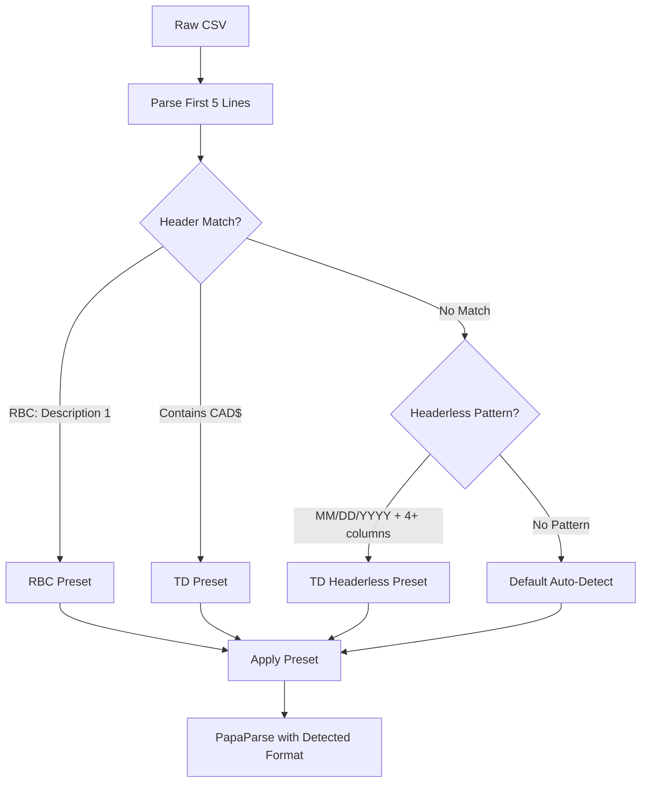

### 5.2 Date Parsing Priority

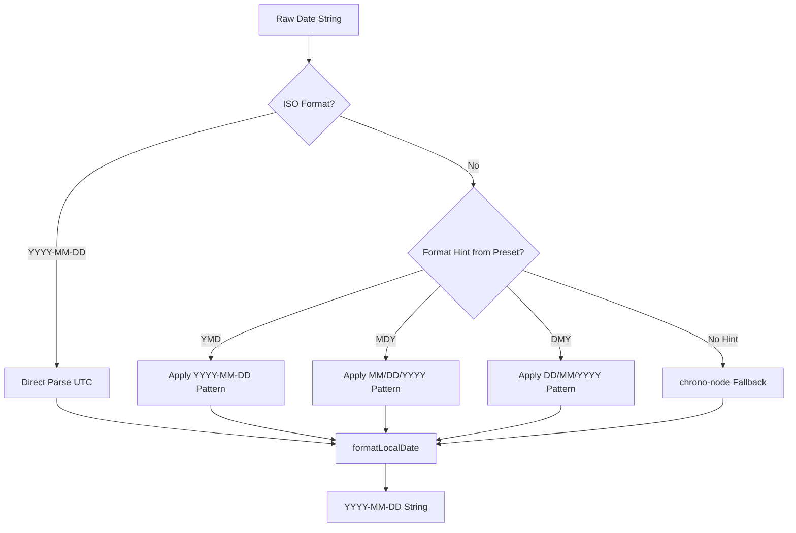

**Why This Priority?**

1. **ISO format first** - Unambiguous, no parsing errors
2. **Preset format hint** - Handles ambiguous dates like 02/03/2025 correctly
3. **chrono-node fallback** - Handles natural language and weird formats

### 5.3 Amount Parsing Edge Cases

**Supported Formats:**

| Input | Detected Format | Output (Milliunits) |
|-------|-----------------|---------------------|
| `45.23` | Standard | 45230 |
| `$45.23` | USD Symbol | 45230 |
| `CAD 45.23` | Currency Code | 45230 |
| `1,234.56` | Thousands Separator | 1234560 |
| `1.234,56` | European Format | 1234560 |
| `(45.23)` | Parentheses Negative | -45230 |
| `-45.23` | Explicit Negative | -45230 |

**Debit/Credit Column Handling:**

```typescript
if (Math.abs(debitMilliunits) > 0 && Math.abs(creditMilliunits) > 0) {
  // WARNING: Both columns populated - use debit
  rowWarnings.push(`Both Debit (${debit}) and Credit (${credit}) have values - using Debit`);
  warnings.push({ row: rowNum, message: rowWarnings[0] });
}

if (Math.abs(debitMilliunits) > 0) {
  amountMilliunits = -Math.abs(debitMilliunits);  // Debits are outflows
} else if (Math.abs(creditMilliunits) > 0) {
  amountMilliunits = Math.abs(creditMilliunits);  // Credits are inflows
} else {
  amountMilliunits = 0;
}
```

### 5.4 Security Measures

**Input Validation:**

```typescript
// File size limit: 10MB default
const MAX_BYTES = options.maxBytes ?? 10 * 1024 * 1024;
if (content.length > MAX_BYTES) {
  throw new Error(`File size exceeds limit of ${Math.round(MAX_BYTES / 1024 / 1024)}MB`);
}

// Row limit: 10,000 default
const maxRows = options.maxRows ?? 10000;
```

**Unicode Sanitization:**

```typescript
// Remove malicious/confusing characters
rawDesc = rawDesc
  .replace(/[\u0000-\u001F\u007F-\u009F]/g, '')  // Control chars
  .replace(/[\u202A-\u202E\u2066-\u2069]/g, '')  // Bidirectional overrides
  .replace(/[\u200B-\u200D\uFEFF]/g, '')         // Zero-width chars
  .replace(/[\u2028-\u2029]/g, '')                // Line/paragraph separators
  .substring(0, 500);  // YNAB max memo length
```

---

## 6. Execution Engine

### 6.1 Execution Phases

The executor implements a **4-phase execution strategy** with early termination once balance aligns.

**Phase Overview:**

| Phase | Trigger | Purpose | Balance Check |
|-------|---------|---------|---------------|
| 1 | `auto_create_transactions` | Create missing bank transactions | After each create |
| 2 | `auto_update_cleared_status` | Mark matched YNAB txns as cleared | After each update |
| 3 | `auto_unclear_missing` | Un-clear YNAB txns not on statement | After each unclear |
| 4 | Balance aligned | Mark all matched txns as reconciled | N/A |

**Early Termination:**

```typescript
const recordAlignmentIfNeeded = (trigger: string, { log = true } = {}) => {
  if (balanceAligned) return true;

  if (Math.abs(clearedDeltaMilli) <= balanceToleranceMilli) {
    balanceAligned = true;
    if (log) {
      actions_taken.push({
        type: 'balance_checkpoint',
        transaction: null,
        reason: `Cleared delta ${deltaDisplay} within ±${toleranceDisplay} after ${trigger} - halting`,
      });
    }
    return true;
  }
  return false;
};
```

### 6.2 Bulk vs Sequential Operations

**Decision Matrix:**

| Scenario | Strategy | Rationale |
|----------|----------|-----------|
| 2+ unmatched bank txns | Bulk create | API efficiency |
| 1 unmatched bank txn | Sequential create | Simpler error handling |
| Bulk API failure | Sequential fallback | Resilience |
| Updates (cleared, date) | Always bulk (chunked) | YNAB supports batch updates |

**Bulk Create Flow:**

```typescript
// Build batches until balance aligns or all processed
while (nextBankIndex < orderedUnmatchedBank.length && !balanceAligned) {
  const batch: PreparedBulkCreateEntry[] = [];
  let projectedDelta = clearedDeltaMilli;

  // Greedy batch: add transactions until balance would align
  while (nextBankIndex < orderedUnmatchedBank.length) {
    const entry = buildPreparedEntry(orderedUnmatchedBank[nextBankIndex]);
    batch.push(entry);
    nextBankIndex += 1;
    projectedDelta = addMilli(projectedDelta, entry.amountMilli);

    if (Math.abs(projectedDelta) <= balanceToleranceMilli) {
      break;  // This batch should align balance
    }
  }

  // Process batch in chunks of MAX_BULK_CREATE_CHUNK (100)
  const chunks = chunkArray(batch, MAX_BULK_CREATE_CHUNK);
  for (const chunk of chunks) {
    try {
      await processBulkChunk(chunk, chunkIndex);
    } catch (error) {
      // Fallback to sequential
      await processSequentialEntries(chunk, { chunkIndex, fallbackError: error });
    }
  }
}
```

### 6.3 Correlation Tracking

**Problem:** Bulk API returns transactions in arbitrary order. How to match responses to requests?

**Solution:** Hash-based correlation keys

```typescript
// Generate correlation key from transaction attributes
export function generateCorrelationKey(txn: CorrelationPayload): string {
  const key = `${txn.account_id}|${txn.date}|${txn.amount}|${normalizePayee(txn.payee_name)}`;
  return createHash('sha256').update(key).digest('hex').slice(0, 16);
}

// Correlate responses
export function correlateResults(
  requests: CorrelationPayload[],
  response: BulkResponse,
  duplicateImportIds: Set<string>,
): CorrelationResult[] {
  const results: CorrelationResult[] = [];

  for (let i = 0; i < requests.length; i++) {
    const request = requests[i];
    const correlationKey = generateCorrelationKey(request);

    // Try to find in created transactions
    const created = response.transactions?.find(t =>
      generateCorrelationKey(toCorrelationPayload(t)) === correlationKey
    );

    if (created) {
      results.push({ status: 'created', request_index: i, transaction_id: created.id, correlation_key: correlationKey });
    } else if (duplicateImportIds.has(request.import_id ?? '')) {
      results.push({ status: 'duplicate', request_index: i, correlation_key: correlationKey });
    } else {
      results.push({ status: 'failed', request_index: i, correlation_key: correlationKey, error: 'Not in response' });
    }
  }

  return results;
}
```

### 6.4 Error Recovery

**Retry Strategy:**

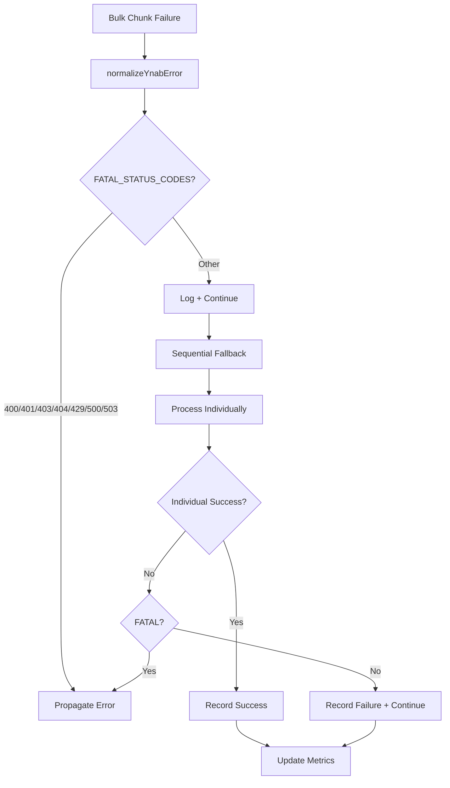

**Fatal vs Recoverable Errors:**

```typescript
const FATAL_YNAB_STATUS_CODES = new Set([
  400,  // Bad Request - malformed payload
  401,  // Unauthorized - invalid token
  403,  // Forbidden - insufficient permissions
  404,  // Not Found - budget/account doesn't exist
  429,  // Too Many Requests - rate limited
  500,  // Internal Server Error - YNAB backend issue
  503,  // Service Unavailable - YNAB maintenance
]);
```

---

## 7. Type System

### 7.1 Core Types

**Canonical Transaction Types:**

```typescript
// File: src/types/reconciliation.ts

/**
 * Bank transaction from CSV parsing.
 * CRITICAL: amount is in MILLIUNITS (integers, 1000 = $1.00)
 */
export interface BankTransaction {
  id: string;                 // UUID
  date: string;               // YYYY-MM-DD
  amount: number;             // Milliunits (integer)
  payee: string;
  memo?: string;
  sourceRow: number;          // CSV row number (1-indexed)
  raw: {
    date: string;
    amount: string;
    description: string;
  };
  warnings?: string[];
}

/**
 * Normalized YNAB transaction for matching.
 * CRITICAL: amount is in MILLIUNITS (same as YNAB API)
 */
export interface NormalizedYNABTransaction {
  id: string;
  date: string;               // YYYY-MM-DD
  amount: number;             // Milliunits (integer)
  payee: string | null;
  memo: string | null;
  categoryName: string | null;
  cleared: 'cleared' | 'uncleared' | 'reconciled';
  approved: boolean;
}
```

**Match Result Types:**

```typescript
// File: src/tools/reconciliation/types.ts

export type MatchConfidence = 'high' | 'medium' | 'low' | 'none';

export interface TransactionMatch {
  bankTransaction: BankTransaction;
  ynabTransaction?: YNABTransaction;
  candidates?: MatchCandidate[];
  confidence: MatchConfidence;
  confidenceScore: number;  // 0-100
  matchReason: string;
  topConfidence?: number;
  actionHint?: string;
  recommendation?: string;
}

export interface MatchCandidate {
  ynab_transaction: YNABTransaction;
  confidence: number;
  match_reason: string;
  explanation: string;
}
```

**Recommendation Types:**

```typescript
// File: src/tools/reconciliation/types.ts

export type ActionableRecommendation =
  | CreateTransactionRecommendation
  | UpdateClearedRecommendation
  | ReviewDuplicateRecommendation
  | ManualReviewRecommendation;

export interface CreateTransactionRecommendation {
  id: string;
  action_type: 'create_transaction';
  priority: 'high' | 'medium' | 'low';
  confidence: number;  // 0-1
  message: string;
  reason: string;
  estimated_impact: MoneyValue;
  account_id: string;
  parameters: {
    account_id: string;
    date: string;
    amount: number;  // Milliunits
    payee_name: string;
    memo?: string;
    cleared: 'cleared' | 'uncleared';
    approved: boolean;
  };
}
```

### 7.2 Analysis Result Type

```typescript
export interface ReconciliationAnalysis {
  success: true;
  phase: 'analysis';
  summary: ReconciliationSummary;
  auto_matches: TransactionMatch[];
  suggested_matches: TransactionMatch[];
  unmatched_bank: BankTransaction[];
  unmatched_ynab: YNABTransaction[];
  balance_info: BalanceInfo;
  next_steps: string[];
  insights: ReconciliationInsight[];
  recommendations?: ActionableRecommendation[];
}

export interface ReconciliationSummary {
  statement_date_range: string;
  bank_transactions_count: number;
  ynab_transactions_count: number;
  auto_matched: number;
  suggested_matches: number;
  unmatched_bank: number;
  unmatched_ynab: number;
  current_cleared_balance: MoneyValue;
  target_statement_balance: MoneyValue;
  discrepancy: MoneyValue;
  discrepancy_explanation: string;
}
```

---

## 8. Integration Points

### 8.1 YNAB API Integration

**Delta Fetching:**

```typescript
// Fetch transactions with delta support for efficiency
const transactionsResult = forceFullRefresh
  ? await deltaFetcher.fetchTransactionsByAccountFull(budget_id, account_id, since_date)
  : await deltaFetcher.fetchTransactionsByAccount(budget_id, account_id, since_date);

// Result includes metadata
{
  data: TransactionDetail[],
  wasCached: boolean,
  usedDelta: boolean,
  serverKnowledge: number,
}
```

**Bulk Operations:**

```typescript
// Create multiple transactions
const response = await ynabAPI.transactions.createTransactions(budgetId, {
  transactions: [
    { account_id, date, amount, payee_name, cleared: 'cleared', approved: true, import_id },
    // ... more transactions
  ],
});

// Update multiple transactions
const response = await ynabAPI.transactions.updateTransactions(budgetId, {
  transactions: [
    { id: txn_id_1, cleared: 'cleared' },
    { id: txn_id_2, date: '2025-09-20' },
    // ... more updates
  ],
});
```

### 8.2 MCP Tool Interface

**Request Schema:**

```typescript
export const ReconcileAccountSchema = z.object({
  budget_id: z.string().min(1),
  account_id: z.string().min(1),

  // CSV Input (one required)
  csv_file_path: z.string().optional(),
  csv_data: z.string().optional(),

  csv_format: z.object({
    date_column: z.union([z.string(), z.number()]).optional(),
    amount_column: z.union([z.string(), z.number()]).optional(),
    debit_column: z.union([z.string(), z.number()]).optional(),
    credit_column: z.union([z.string(), z.number()]).optional(),
    description_column: z.union([z.string(), z.number()]).optional(),
    date_format: z.string().optional(),
    has_header: z.boolean().optional(),
    delimiter: z.string().optional(),
  }).optional(),

  // Statement Information
  statement_balance: z.number(),
  statement_start_date: z.string().optional(),
  statement_end_date: z.string().optional(),
  statement_date: z.string().optional(),

  // Matching Configuration
  date_tolerance_days: z.number().min(0).max(7).default(7),
  amount_tolerance_cents: z.number().min(0).max(100).default(1),
  auto_match_threshold: z.number().min(0).max(100).default(85),
  suggestion_threshold: z.number().min(0).max(100).default(60),

  // Automation Toggles
  auto_create_transactions: z.boolean().default(false),
  auto_update_cleared_status: z.boolean().default(false),
  auto_unclear_missing: z.boolean().default(true),
  auto_adjust_dates: z.boolean().default(false),
  invert_bank_amounts: z.boolean().optional(),
  dry_run: z.boolean().default(true),

  // Response Options
  include_structured_data: z.boolean().default(false),
  force_full_refresh: z.boolean().default(true),
});
```

**Response Format:**

```typescript
{
  content: [
    {
      type: 'text',
      text: responseFormatter.format({
        human: formatHumanReadableReport(analysis, execution),
        structured: {  // Only if include_structured_data = true
          version: '2.0',
          analysis: ReconciliationAnalysis,
          execution: ExecutionResult,
          audit_metadata: { ... },
        },
      }),
    },
  ],
}
```

---

## 9. Performance Characteristics

### 9.1 Complexity Analysis

| Operation | Complexity | Notes |
|-----------|------------|-------|
| CSV Parsing | O(N) | N = rows; PapaParse streams large files |
| YNAB Normalization | O(M) | M = YNAB transactions |
| Basic Matching | O(N × M) | N = bank txns, M = YNAB txns |
| Payee Fuzzy Matching | O(L²) per pair | L = string length; fuzzball optimized |
| Bulk Create | O(N/100) API calls | Chunked by MAX_BULK_CREATE_CHUNK |
| Bulk Update | O(M/100) API calls | Chunked by MAX_BULK_UPDATE_CHUNK |

### 9.2 Scale Limits

| CSV Size | Expected Performance | Recommendations |
|----------|---------------------|------------------|
| <100 txns | <500ms | Default settings |
| 100-500 txns | <2s | Default settings |
| 500-1000 txns | 2-10s | Consider chunking by month |
| >1000 txns | May timeout | Process in batches |

### 9.3 Optimization Strategies

**Current Optimizations:**

1. **Integer Arithmetic** - No floating-point comparisons
2. **Early Termination** - Stop when balance aligns
3. **Bulk Operations** - Minimize API calls
4. **Delta Fetching** - Only fetch changed transactions

**Future Optimizations:**

1. **Amount Bucketing** - Index YNAB transactions by amount for O(1) lookup
2. **Date Windowing** - Only compare transactions within ±14 days
3. **Streaming CSV** - Parse in chunks for large files
4. **Parallel Matching** - Use worker threads for CPU-bound fuzzy matching

### 9.4 Memory Usage

**Estimated Memory Footprint:**

```
CSV (500 txns):     ~100 KB raw text
BankTransaction[]:  ~200 KB (400 bytes/txn × 500)
YNAB API (1000):    ~500 KB raw JSON
NormalizedYNAB[]:   ~400 KB (400 bytes/txn × 1000)
MatchResults[]:     ~300 KB (600 bytes/match × 500)
Total:              ~1.5 MB for 500-txn reconciliation
```

**Memory Safety:**

```typescript
// Security limits in csvParser.ts
const MAX_BYTES = options.maxBytes ?? 10 * 1024 * 1024;  // 10MB
const maxRows = options.maxRows ?? 10000;

// PapaParse preview limits rows in memory
const parsed = Papa.parse(content, {
  preview: maxRows + (hasHeader ? 1 : 0),
  skipEmptyLines: true,
});
```

---

## 10. Testing Strategy

### 10.1 Test Coverage

**Unit Tests:**

| Component | Test File | Coverage Focus |
|-----------|-----------|----------------|
| csvParser | csvParser.test.ts | Format detection, amount parsing, date parsing |
| matcher | matcher.test.ts | Scoring algorithm, candidate filtering, tie-breaking |
| analyzer | analyzer.test.ts | Orchestration, insight generation, balance calculation |
| executor | executor.test.ts | Bulk operations, correlation, error handling |
| recommendationEngine | recommendationEngine.test.ts | Recommendation generation, prioritization |

**Integration Tests:**

| Scenario | Test File | Purpose |
|----------|-----------|---------|
| TD Bank CSV | csvParser.integration.test.ts | Real-world TD format |
| RBC Debit/Credit | csvParser.integration.test.ts | Debit/credit column handling |
| Bulk Create | executor.integration.test.ts | Bulk API with mocked YNAB |
| End-to-End | reconciliation.e2e.test.ts | Full flow with real YNAB API |

### 10.2 Test Data

**Fixtures:**

```
test-exports/csv/
├── td-credit-card.csv           # TD headerless format
├── rbc-checking.csv             # RBC debit/credit columns
├── wealthsimple-cash.csv        # Wealthsimple headered format
├── scotiabank-savings.csv       # Scotiabank format
├── tangerine-checking.csv       # Tangerine format
└── edge-cases/
    ├── european-numbers.csv     # 1.234,56 format
    ├── both-debit-credit.csv    # Ambiguous columns
    └── malformed.csv            # Missing fields, bad dates
```

### 10.3 Accuracy Metrics

**Evaluation Dataset:**

```typescript
// test-exports/csv/labeled/
{
  "csv_file": "td-credit-card.csv",
  "ground_truth": [
    {
      "bank_row": 2,
      "ynab_transaction_id": "abc123",
      "expected_confidence": "high",
      "notes": "Exact amount and payee match"
    },
    {
      "bank_row": 3,
      "ynab_transaction_id": null,
      "expected_confidence": "none",
      "notes": "New transaction, should create"
    }
  ]
}
```

**Benchmark Metrics:**

```bash
npm run benchmark:reconciliation -- --dataset=test-exports/csv/labeled/

Output:
  Auto-Match Precision:  95.2% (20/21 correct)
  Auto-Match Recall:     90.9% (20/22 true matches)
  Overall Match Rate:    96.0% (48/50 matched at any level)
  False Positive Rate:    4.8% (1/21 incorrect)
  P95 Latency:          1.2s (500-txn CSV)
```

---

## Appendix A: Sequence Diagrams

### A.1 Create Transaction Flow

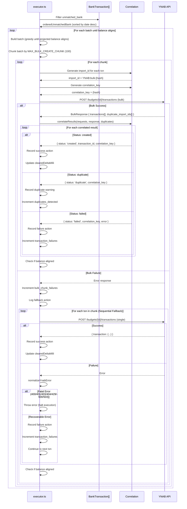

### A.2 Match Scoring Flow

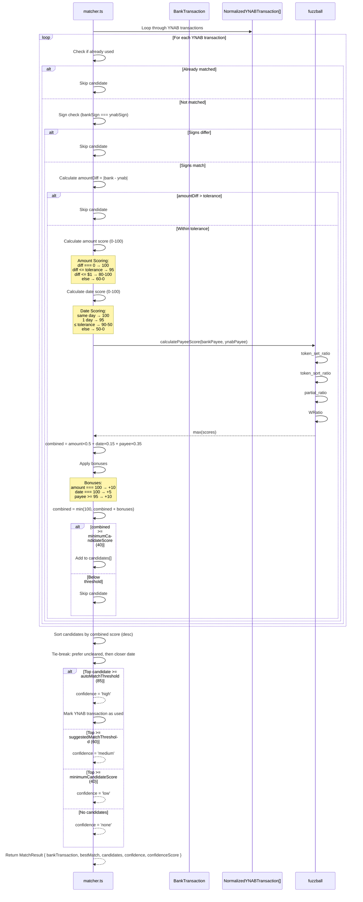

---

## Appendix B: Configuration Examples

### B.1 Conservative Matching

```json
{
  "date_tolerance_days": 3,
  "amount_tolerance_cents": 0,
  "auto_match_threshold": 95,
  "suggestion_threshold": 75,
  "auto_create_transactions": false,
  "auto_update_cleared_status": false,
  "dry_run": true
}
```

### B.2 Aggressive Matching

```json
{
  "date_tolerance_days": 14,
  "amount_tolerance_cents": 5,
  "auto_match_threshold": 75,
  "suggestion_threshold": 50,
  "auto_create_transactions": true,
  "auto_update_cleared_status": true,
  "auto_unclear_missing": true,
  "dry_run": false
}
```

### B.3 Manual Review Only

```json
{
  "auto_create_transactions": false,
  "auto_update_cleared_status": false,
  "auto_unclear_missing": false,
  "dry_run": true,
  "include_structured_data": true
}
```

---

## Appendix C: Troubleshooting

### C.1 Common Issues

| Issue | Likely Cause | Solution |
|-------|-------------|----------|
| Low match rate (<50%) | CSV format not detected | Specify `csv_format.preset` explicitly |
| All matches "none" | Sign inversion needed | Set `invert_bank_amounts: true` |
| Date parsing errors | Ambiguous date format | Specify `csv_format.date_format` |
| Amount parsing errors | European number format | Parser auto-detects, check warnings |
| Balance never aligns | Missing transactions | Check `unmatched_bank` and `unmatched_ynab` |
| Bulk create failures | Import ID collisions | Check `bulk_operation_details.duplicates_detected` |

### C.2 Diagnostic Output

```typescript
{
  include_diagnostics: true
}
```

Returns:

```json
{
  "diagnostics": {
    "csvParsing": {
      "detectedDelimiter": ",",
      "detectedColumns": ["Date", "Description", "Amount"],
      "totalRows": 50,
      "validRows": 48,
      "errors": [
        { "row": 5, "field": "date", "message": "Could not parse date: '99/99/9999'", "rawValue": "99/99/9999" }
      ],
      "warnings": [
        { "row": 12, "message": "Both Debit ($50.00) and Credit ($25.00) have values - using Debit" }
      ]
    },
    "matchingDetails": [
      {
        "bankTxn": { "date": "2025-09-15", "amount": -45230, "payee": "Shell Gas" },
        "bestMatch": {
          "ynabTxn": { "date": "2025-09-15", "amount": -45230, "payee": "Shell" },
          "scores": { "amount": 100, "date": 100, "payee": 85, "combined": 100 }
        },
        "confidence": "high"
      }
    ]
  }
}
```

---

## Appendix D: Future Enhancements

### D.1 Roadmap

| Priority | Feature | Description | Complexity |
|----------|---------|-------------|------------|
| P0 | Split Transaction Detection | Match 1 bank txn to multiple YNAB txns | High |
| P1 | Merchant Learning | Cache successful payee mappings per user | Medium |
| P1 | Adaptive Thresholds | Learn from user confirmations/rejections | Medium |
| P2 | Vector Embeddings | Semantic merchant matching with embeddings | High |
| P2 | Recurring Pattern Detection | Use historical patterns to boost confidence | Medium |
| P3 | Multi-Currency Support | Handle FX transactions and conversions | High |

### D.2 Split Transaction Detection

**Design Sketch:**

```typescript
// Detect when one bank transaction = multiple YNAB transactions
function findCombinationMatches(
  bankTxn: BankTransaction,
  ynabTransactions: NormalizedYNABTransaction[],
  maxCombinationSize: number = 3,
): CombinationMatch[] {
  // Generate all combinations of size 2 to maxCombinationSize
  const combinations = generateCombinations(ynabTransactions, maxCombinationSize);

  for (const combo of combinations) {
    const totalAmount = combo.reduce((sum, txn) => sum + txn.amount, 0);

    if (Math.abs(totalAmount - bankTxn.amount) <= AMOUNT_TOLERANCE) {
      // Found matching combination
      return {
        bankTransaction: bankTxn,
        ynabTransactions: combo,
        confidence: calculateCombinationConfidence(combo, bankTxn),
      };
    }
  }

  return [];
}
```

---

**End of Document**

---

## Document Metadata

- **File Path:** `C:\Users\ksutk\projects\ynab-mcpb\docs\technical\reconciliation-system-architecture.md`
- **Related Files:**
  - Implementation: `C:\Users\ksutk\projects\ynab-mcpb\src\tools\reconciliation\`
  - Existing Docs: `C:\Users\ksutk\projects\ynab-mcpb\docs\reconciliation-flow.md`
  - Design Doc: `C:\Users\ksutk\projects\ynab-mcpb\docs\plans\reconciliation-v2-redesign.md`
- **Version:** 2.0
- **Status:** Active Implementation
- **Last Verified:** 2025-11-30
